<div align="center">

# 🎯 WatchFlow

### Modern YouTube Playlist & Course Tracking Application

WatchFlow transforms YouTube playlists and video courses into a structured, distraction-free learning experience. Organize long video series, track completion progress, record timestamp-based notes, maintain learning streaks, and resume exactly where you left off.

<p align="center">
  
  
  
  
  
  
</p>

</div>

---

## ✨ Core Features

### 📚 Playlist & Course Management
- **Import YouTube Playlists**: Paste any public YouTube playlist URL or ID to resolve metadata, duration, thumbnails, and full video lists.
- **Playlist Library**: View all imported courses, total video counts, completed stats, and quick actions.
- **Playlist Re-sync**: Fetch new videos added to original YouTube playlists while preserving saved progress and notes.

### 🎥 Distraction-free Learning Workspace
- **Embedded YouTube Player**: Clean learning player with auto-saving video watch progress.
- **Timestamp Notes**: Capture notes associated with specific video timestamps (e.g. `03:45`) and click any note to seek player playback to that exact moment.
- **Resume Watching**: Click "Continue Learning" to resume your active course at the exact video and timestamp where you left off.

### 📊 Learning Analytics & Streaks
- **Dashboard Overview**: Monitor total playlists, total videos, completed videos, and streak metrics.
- **GitHub-style Heatmap**: Visual contribution calendar recording daily learning activity and study duration.

### 🎨 Theme Support & User Experience
- **Dark / Light Mode**: Seamless theme toggle with persistent user preference.
- **Responsive Layout**: Designed for desktop and mobile learning environments.

---
# 🖼️ Application Preview

## 🚀 Getting Started

| Landing | Import Playlist |
|---------|-----------------|
| 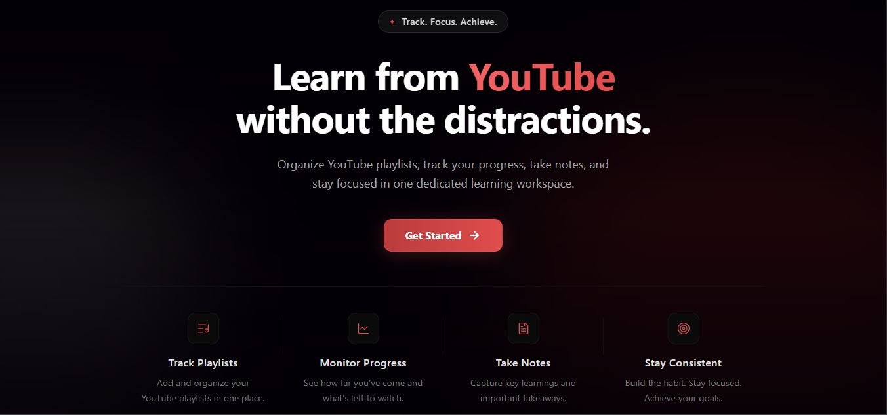 | 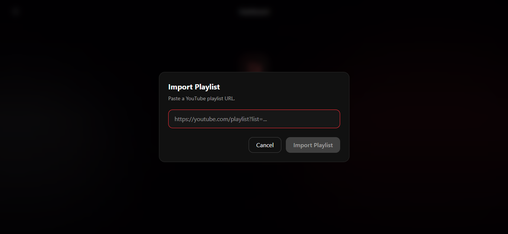 |

---

## 🔐 Authentication

| Register | Login |
|----------|-------|
| 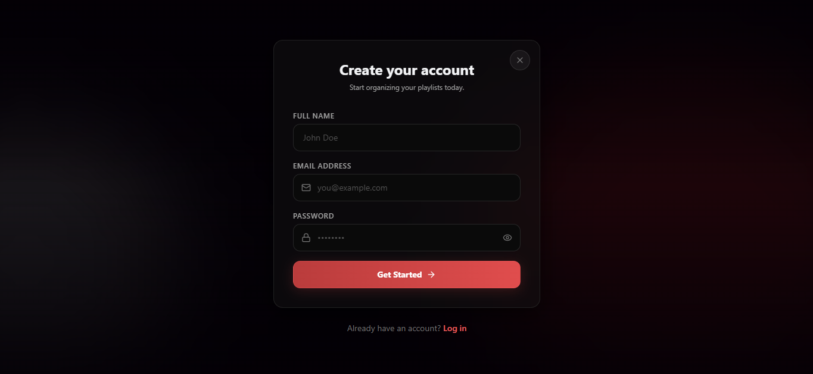 | 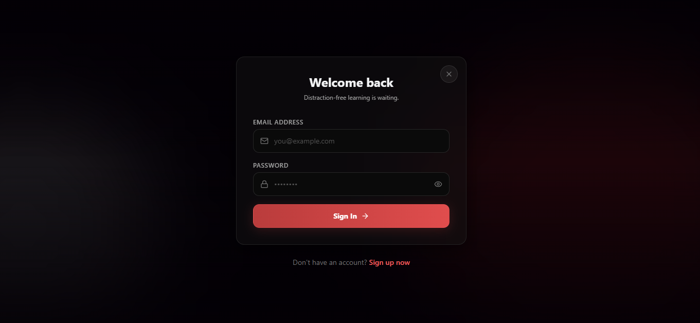 |

---

## 📊 Dashboard

| Dashboard | Library |
|-----------|---------|
| 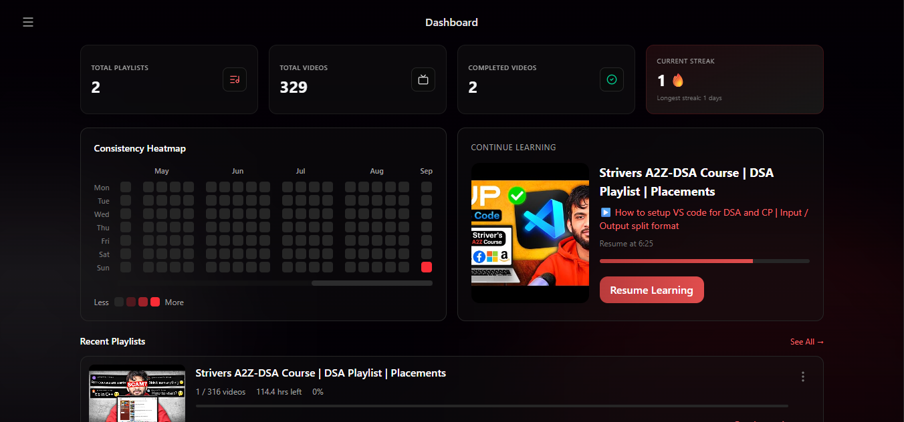 | 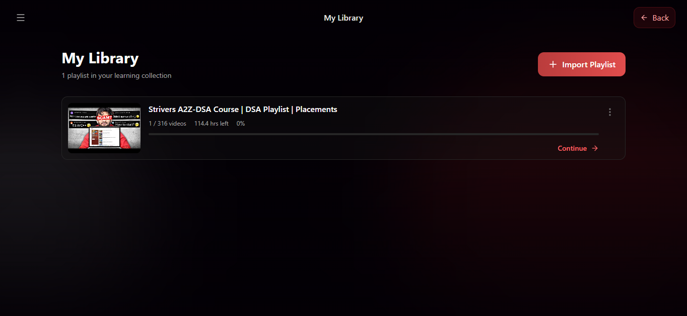 |

---

## 🎥 Learning Workspace

| Playlist Details | Learning Player |
|------------------|-----------------|
| 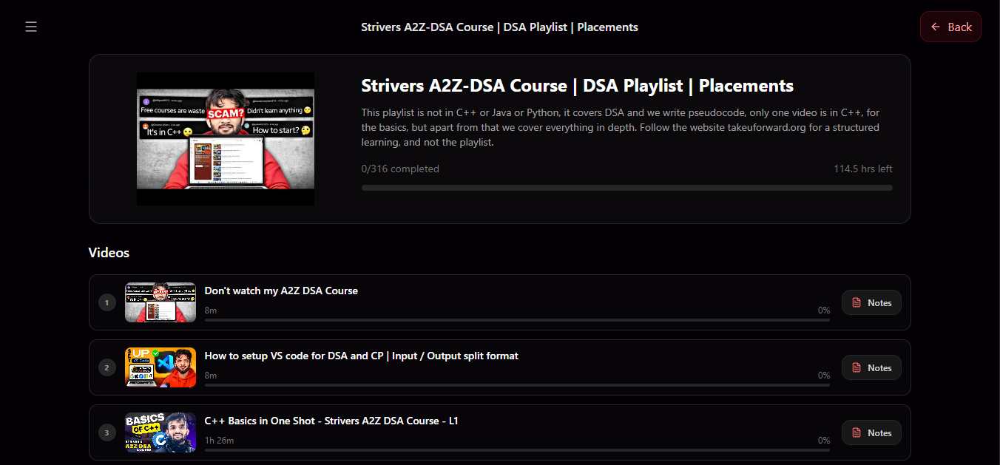 | 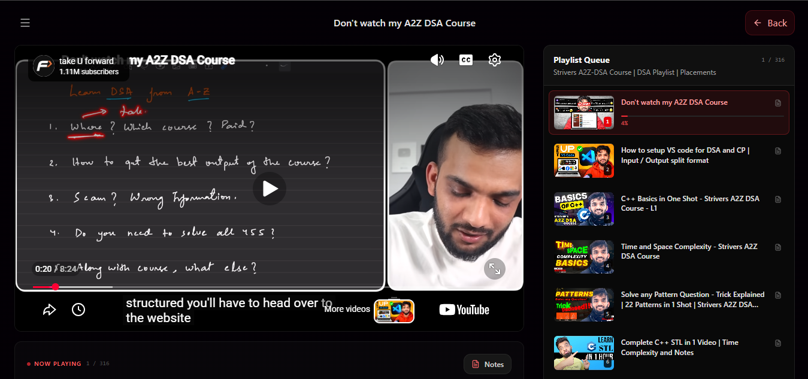 |

---

## 📝 Productivity

| Video Notes | Settings |
|-------------|----------|
| 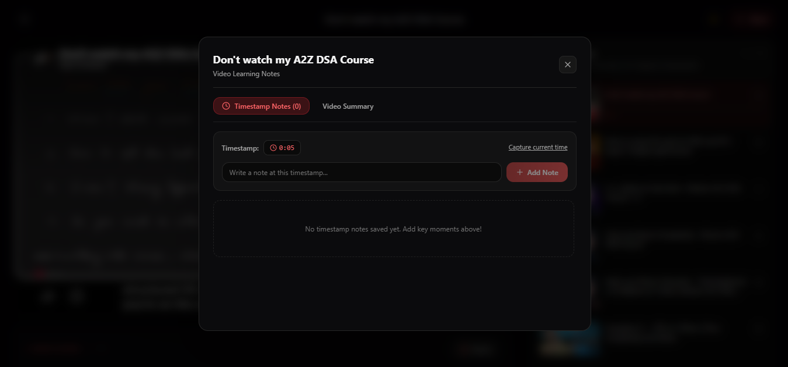 | 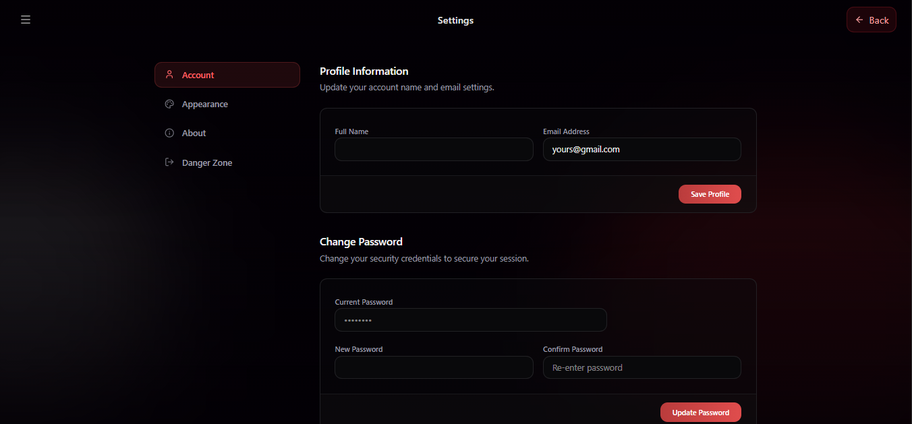 |

---
# 🏗️ System Architecture

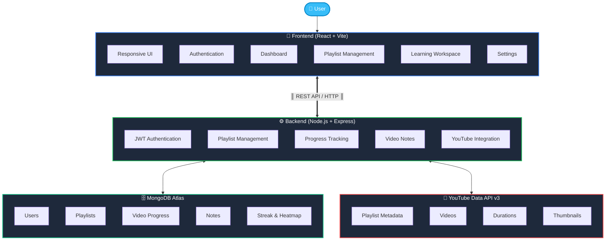
---

## ⚡ Tech Stack

- **Frontend**: React 19, Vite, Tailwind CSS v4, React Router DOM v7, Axios, React YouTube, React Hot Toast, Lucide Icons
- **Backend**: Node.js, Express.js, Mongoose ODM, JWT Authentication, bcryptjs, CORS
- **Database**: MongoDB Atlas
- **External API**: YouTube Data API v3

---

## 📂 Project Structure

```text
WatchFlow Application
├── Client (React 19 + Vite + Tailwind CSS)
│   ├── Context (Auth & Theme management)
│   ├── Pages (Home, Auth, Dashboard, Library, PlaylistDetails, PlaylistPlayer, Settings)
│   └── Components (AppShell, PlayerShell, NotesModal, Heatmap, TopBar, Sidebar)
│
└── Backend Server (Node.js + Express)
    ├── Models (User, Playlist, Video, Note, DailyActivity)
    ├── Controllers (Auth, Dashboard, Playlist, Video, Note, Settings, Streak)
    ├── Services (YouTube Data API v3 Integration with caching)
    └── Serverless Handler (api/index.js for Vercel)
```

---

## 🔑 Environment Variables

### Backend (`server/.env`)
```env
PORT=5000
MONGO_URI=mongodb+srv://<username>:<password>@<cluster>.mongodb.net/?appName=WatchFlow
JWT_SECRET=your_jwt_secret_key
YOUTUBE_API_KEY=your_youtube_data_api_v3_key
```

### Frontend (`client/.env`)
```env
VITE_API_URL=http://localhost:5000/api
```

---

## 🚀 Local Development Setup

### Prerequisites
- Node.js (v18 or higher)
- npm
- MongoDB Atlas cluster connection string
- YouTube Data API v3 key

### 1. Clone the Repository
```bash
git clone <your-repository-url>
cd WatchFlow
```

### 2. Configure Environment Files
- Create `server/.env` with your `MONGO_URI`, `JWT_SECRET`, and `YOUTUBE_API_KEY`.
- Create `client/.env` with `VITE_API_URL=http://localhost:5000/api`.

### 3. Start Backend Server
```bash
cd server
npm install
npm run dev
```

### 4. Start Frontend Application
```bash
cd client
npm install
npm run dev
```

Open your browser at `http://localhost:5173`.

---

## 🌐 Vercel Deployment

1. Connect your repository to Vercel.
2. In Vercel Project Settings, add Environment Variables:
   - `MONGO_URI`
   - `JWT_SECRET`
   - `YOUTUBE_API_KEY`
   - `VITE_API_URL` (Set to `/api` for unified production deployment)
3. Deploy! The root `vercel.json` automatically handles serverless API routing (`/api/*`) and static client hosting.

---

## 📄 License

This project is licensed under the MIT License.