<div align="center">

# 🎯 WatchFlow

### The All-in-One Developer Learning OS & Coding Workspace

Transform open YouTube tutorials into structured study tracks with syllabus progress. Solve top DSA sheets, generate tailored AI roadmaps and explore a categorized resource hub with an integrated AI document study assistant.

<p align="center">
  
  
  
  
  
  
  
  
  
</p>

</div>

---

## 🌟 The 4 Core Pillars

### 1. 🎥 Distraction-Free Playlist Workspace
- **Zero Algorithmic Noise**: Paste any public YouTube playlist to strip away recommendations, comment sections and rabbit holes.
- **Syllabus & Course Queue**: Track multi-hour courses with an interactive curriculum queue, automated duration calculator and real-time progress percentages.
- **Timestamped Video Notes**: Capture Markdown notes pinned to exact video seconds (e.g. `[14:28]`). Click any timestamp to jump player playback straight to that explanation.
- **Smart Resume**: Pick up immediately where you left off on your active course across any device.

### 2. 🧩 Interactive Curated DSA Practice Sheets
- **Industry Standard Tracks**: Over 500+ curated problems across 4 major tracks:
  - 🏆 **Striver's SDE Sheet** (180 essential interview questions)
  - ⚡ **NeetCode 150** (Pattern-based DSA mastery)
  - 🎯 **Blind 75** (High-yield LeetCode classics)
  - 🥋 **Love Babbar 450** (Comprehensive problem sheet)
- **Multi-Language Solutions**: Built-in C++, Java, and Python optimized code snippets with time & space complexity breakdowns.
- **Walkthrough Videos & Notes**: Integrated YouTube video solutions for every problem alongside personal problem-level notes.
- **Difficulty & Topic Filters**: Filter by status (*Solved, Unsolved, Starred*), difficulty (*Easy, Medium, Hard*) or categories (*Arrays, Trees, DP, Graphs*).

### 3. 🧭 Dual-Engine AI Learning Roadmap Generator
- **Personalized Curriculums**: Generate day-by-day structured learning roadmaps for any technology, framework or career role.
- **High-Throughput Multi-AI Engine**: Powered by **Google Gemini** and **Groq (Llama 3.3 70B)** with intelligent cascading failover.
- **Zero-Downtime Offline Fallback**: High-fidelity procedural domain engine ensures roadmaps are instantly generated even if API keys hit rate limits.
- **Sprint & Milestone Tracking**: Daily checklist with core concepts, practical hands-on tasks and curated search queries.

### 4. 📚 Categorized Notes Hub & AI Document Assistant
- **Curated Tech Resource Library**: Study materials organized into clean categories across Technologies, Tools and Core CS Subjects (*OS, DBMS, Computer Networks*).
- **PDF & Excel Viewer**: In-browser document inspection, full-text extraction and download capabilities.
- **AI Document Chatbot**: Ask questions directly to your study materials—powered by Gemini to explain complex concepts, extract definitions and summarize chapters.
- **Cross-Playlist Search & Export**: Search notes across all enrolled playlists and export them to Markdown anytime.

---

## 📊 Consistency & Analytics

- **LeetCode Consistency Heatmap**: Connect your LeetCode username to visualize your real problem-solving streaks alongside video learning.
- **Daily Focus Stats**: Track daily watch time, total playlists enrolled and overall completion percentages.
- **Unified Light & Dark Mode**: Sleek obsidian dark mode and crisp slate light mode with responsive space-warp canvas animations.

---
<br>

# 🖼️ Application Preview 


| Landing | DSA Sheet |
|---------|-----------------|
| 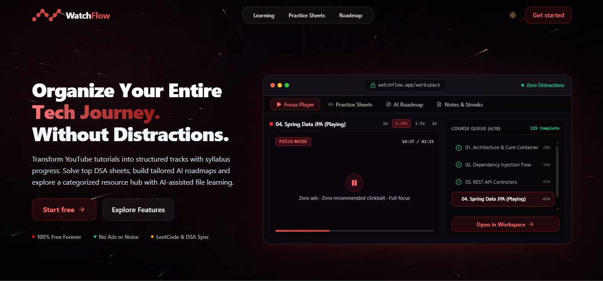 | 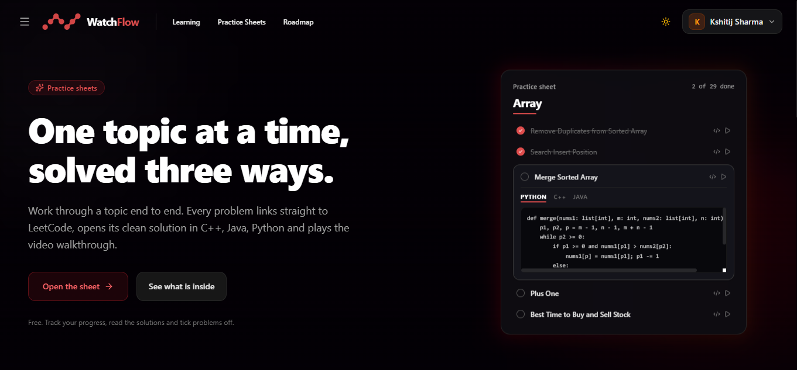 | 

---

| Learning Dashboard | Roadmap |
|----------| --------- |
| 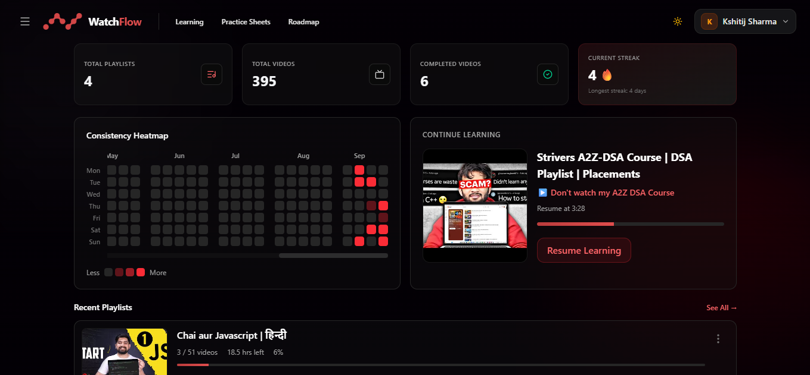 | 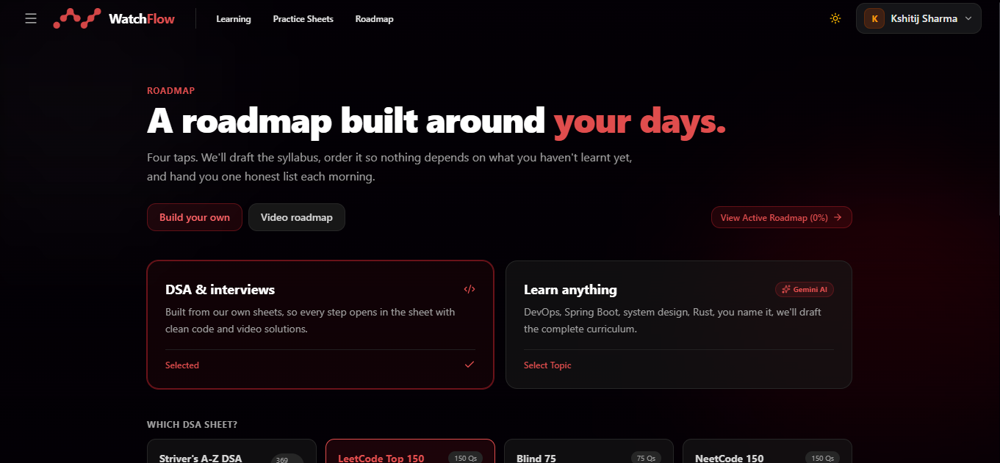 |

---

## 🔐 Authentication

| Register | Login |
|----------|-------|
| 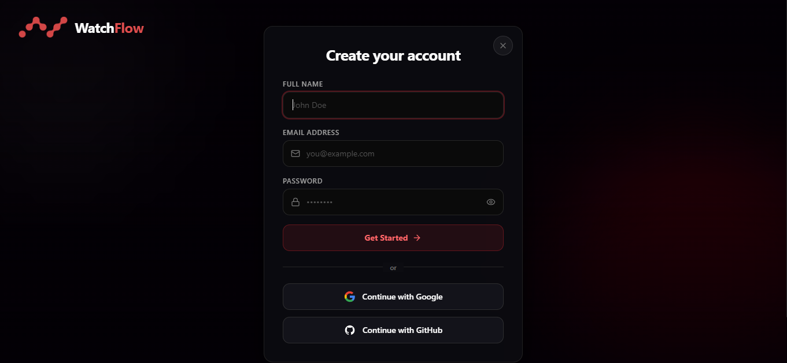 | 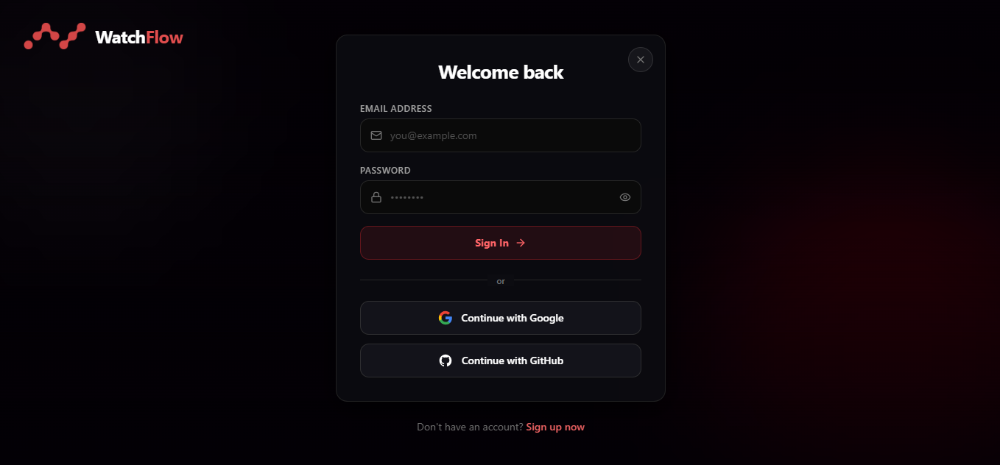 |

---

## 🎥 Workspace

| Players | Playlist Detail |
|------------------|-----------------|
| 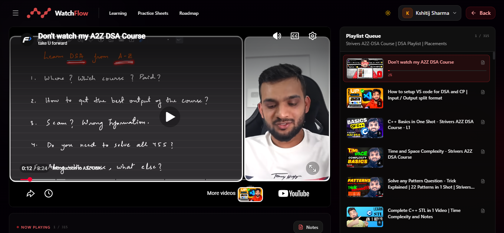 | 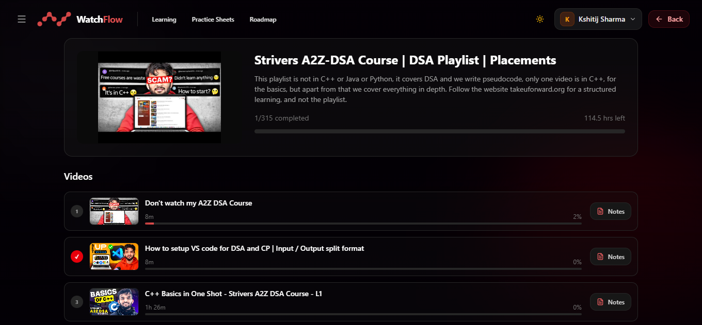 |

---

## 📝 Productivity

| Notes |  Library |
|-----------|---------| 
|  | 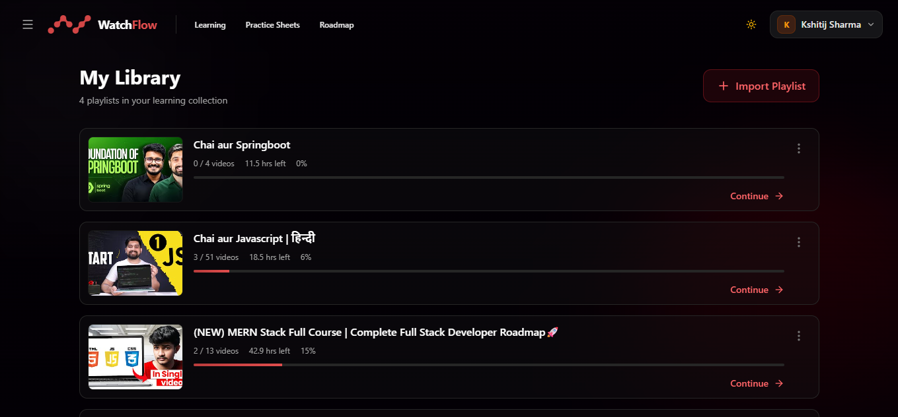 |

---

## 📊 Dashboard

| Settings | Feedback |
|-------------|----------|
| 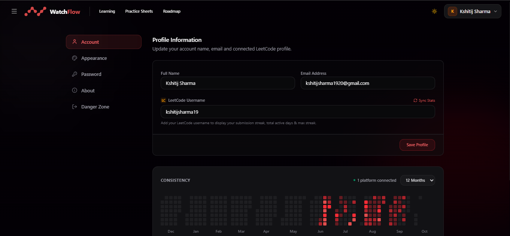 | 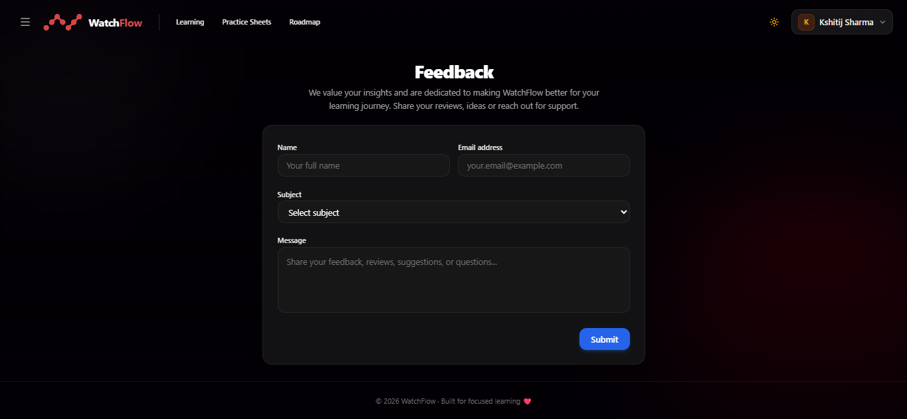 |


---

## 🏗️ System Architecture

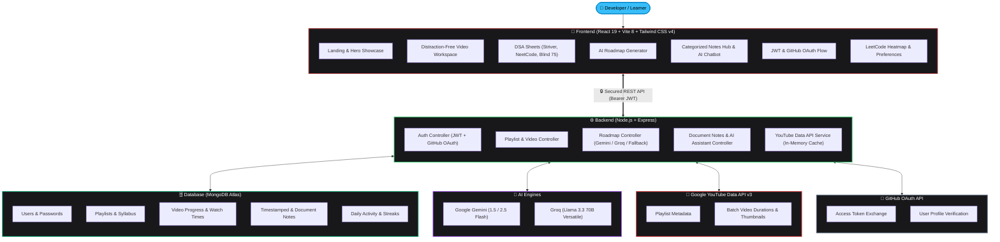
```mermaid
flowchart TD
    User([👤 Developer / Learner]) --> Client

    subgraph Client ["🎨 Frontend (React 19 + Vite 8 + Tailwind CSS v4)"]
        direction TB
        UI_Home["Landing & Hero Showcase"]
        UI_Player["Distraction-Free Video Workspace"]
        UI_Sheets["DSA Sheets (Striver, NeetCode, Blind 75)"]
        UI_Roadmap["AI Roadmap Generator"]
        UI_Notes["Categorized Notes Hub & AI Chatbot"]
        UI_Auth["JWT & GitHub OAuth Flow"]
        UI_Settings["LeetCode Heatmap & Preferences"]
    end

    Client <===>|"🔒 Secured REST API (Bearer JWT)"| Server

    subgraph Server ["⚙️ Backend (Node.js + Express)"]
        direction TB
        Ctrl_Auth["Auth Controller (JWT + GitHub OAuth)"]
        Ctrl_Playlist["Playlist & Video Controller"]
        Ctrl_Roadmap["Roadmap Controller (Gemini / Groq / Fallback)"]
        Ctrl_Notes["Document Notes & AI Assistant Controller"]
        Svc_YT["YouTube Data API Service (In-Memory Cache)"]
    end

    Server <---> DB
    Server <---> Ext_AI
    Server <---> Ext_YT
    Server <---> Ext_GH

    subgraph DB ["🗄️ Database (MongoDB Atlas)"]
        direction TB
        M_Users["Users & Passwords"]
        M_Playlists["Playlists & Syllabus"]
        M_Videos["Video Progress & Watch Times"]
        M_Notes["Timestamped & Document Notes"]
        M_Activity["Daily Activity & Streaks"]
    end

    subgraph Ext_AI ["🤖 AI Engines"]
        direction TB
        AI_Gemini["Google Gemini (1.5 / 2.5 Flash)"]
        AI_Groq["Groq (Llama 3.3 70B Versatile)"]
    end

    subgraph Ext_YT ["📡 Google YouTube Data API v3"]
        direction TB
        YT_Playlists["Playlist Metadata"]
        YT_Items["Batch Video Durations & Thumbnails"]
    end

    subgraph Ext_GH ["🐙 GitHub OAuth API"]
        direction TB
        GH_Token["Access Token Exchange"]
        GH_User["User Profile Verification"]
    end

    %% Styles
    style User fill:#38bdf8,stroke:#0284c7,color:#000,stroke-width:2px
    style Client fill:#18181b,stroke:#BA3C3C,color:#fff,stroke-width:2px
    style Server fill:#18181b,stroke:#22c55e,color:#fff,stroke-width:2px
    style DB fill:#18181b,stroke:#10b981,color:#fff,stroke-width:2px
    style Ext_AI fill:#18181b,stroke:#a855f7,color:#fff,stroke-width:2px
    style Ext_YT fill:#18181b,stroke:#ef4444,color:#fff,stroke-width:2px
    style Ext_GH fill:#18181b,stroke:#64748b,color:#fff,stroke-width:2px
```

---

## 🔒 Security Hardening

WatchFlow implements production-grade security standards to prevent credential leakage and information disclosure:
- **Zero Client-Side Secrets**: All third-party AI keys (Gemini, Groq), YouTube API keys, database URIs and OAuth client secrets reside strictly on the server environment.
- **Header-Based Authentication**: Google Gemini and YouTube API requests pass keys exclusively via `x-goog-api-key` HTTP headers rather than URL query parameters, preventing exposure in server logs, proxy logs or request URLs.
- **Sanitized Error Responses**: Internal database exceptions and third-party API errors are caught and sanitized before responding to clients, preventing stack trace disclosure.
- **Strict `.gitignore` Boundaries**: Comprehensive recursive patterns protect all `.env`, `.env.*` and private certificate files.

---

## ⚡ Tech Stack

| Domain | Technology |
| :--- | :--- |
| **Frontend Framework** | React 19, Vite 8 |
| **Styling & Animations** | Tailwind CSS v4, Lucide React Icons |
| **Routing & State** | React Router DOM v7, React Context API (`AuthContext`, `ThemeContext`) |
| **Backend Framework** | Node.js, Express.js |
| **Database & ORM** | MongoDB Atlas, Mongoose ODM |
| **AI Integration** | Google Gemini API (`gemini-1.5-flash`), Groq SDK (`llama-3.3-70b`) |
| **External APIs** | YouTube Data API v3, GitHub OAuth 2.0, Google OAuth 2.0 |
| **Authentication** | JSON Web Tokens (JWT), bcryptjs password hashing |
| **HTTP Client** | Axios with custom request/response interceptors |
| **Notifications** | React Hot Toast |

---

## 📂 Project Structure

```text
WatchFlow
├── client/                               # Frontend Application (React 19 + Vite 8)
│   ├── public/                           # Static assets, logos and favicon
│   ├── src/
│   │   ├── api/                          # Axios instance with auth interceptor
│   │   ├── components/
│   │   │   ├── common/                   # ProtectedRoute, SpaceWarpBackground, ScrollToTop
│   │   │   ├── home/                     # HeroProductPreview (interactive Mac preview)
│   │   │   ├── layout/                   # AppShell, TopBar, Sidebar, Footer
│   │   │   ├── modals/                   # NotesModal, ConfirmModal
│   │   │   ├── playlist/                 # PlaylistCard, VideoRow
│   │   │   ├── settings/                 # LeetcodeConsistencyHeatmap
│   │   │   └── sheets/                   # SolutionModal, VideoModal, NoteModal
│   │   ├── context/                      # AuthContext, ThemeContext
│   │   ├── data/                         # Striver SDE, NeetCode 150, Blind 75, Babbar 450 datasets
│   │   ├── hooks/                        # useImportPlaylist, useSettings, useResyncPlaylist
│   │   ├── pages/                        # Home, Auth, Dashboard, Library, Sheets, SheetDetail, Roadmap, NotesHub
│   │   └── utils/                        # roadmapGenerator, formatters
│   ├── .env.example                      # Client environment template
│   └── package.json
│
├── server/                               # Backend API Server (Node.js + Express)
│   ├── config/                           # MongoDB database connection (Mongoose)
│   ├── controllers/                      # Auth, Playlist, Video, Roadmap, DocumentNotes, Settings
│   ├── middleware/                       # authMiddleware, optionalAuth
│   ├── models/                           # User, Playlist, Video, DocumentNote, DailyActivity
│   ├── routes/                           # Express route definitions (/api/*)
│   ├── services/                         # YouTube Data API v3 integration with TTL caching
│   ├── utils/                            # generateToken, validators
│   ├── .env.example                      # Backend environment template
│   └── server.js                         # Application entrypoint
│
├── vercel.json                           # Unified full-stack Vercel deployment config
└── README.md                             # Project documentation
```

---

## 🔑 Environment Configuration

### Backend (`server/.env`)
```env
PORT=5000
MONGO_URI=mongodb+srv://<username>:<password>@<cluster>.mongodb.net/?appName=WatchFlow
JWT_SECRET=your_jwt_secret_key
YOUTUBE_API_KEY=your_youtube_data_api_v3_key
GITHUB_CLIENT_ID=your_github_oauth_client_id
GITHUB_CLIENT_SECRET=your_github_oauth_client_secret
GOOGLE_CLIENT_ID=your_google_oauth_client_id
GOOGLE_CLIENT_SECRET=your_google_oauth_client_secret
CLIENT_URL=http://localhost:5173

# AI Roadmap & Study Assistant Engines
GEMINI_API_KEY=your_google_gemini_api_key
GROQ_API_KEY=your_groq_api_key
```

### Frontend (`client/.env`)
```env
VITE_API_URL=http://localhost:5000/api
VITE_GITHUB_CLIENT_ID=your_github_oauth_client_id
VITE_GOOGLE_CLIENT_ID=your_google_oauth_client_id
```

---

## 🚀 Local Development Setup

### Prerequisites
- [Node.js](https://nodejs.org/) (v18 or higher recommended)
- [npm](https://www.npmjs.com/)
- A free [MongoDB Atlas](https://www.mongodb.com/atlas) cluster
- A [Google Cloud Console](https://console.cloud.google.com/) YouTube Data API v3 key
- Optional: [Google AI Studio](https://aistudio.google.com/) Gemini Key & [Groq Console](https://console.groq.com/) API key

### 1. Clone Repository
```bash
git clone https://github.com/KshitijSharma19/WatchFlow.git
cd WatchFlow
```

### 2. Configure Environment Variables
```bash
# Server configuration
cp server/.env.example server/.env

# Client configuration
cp client/.env.example client/.env
```
Fill in your credentials in `server/.env` and `client/.env`.

### 3. Start Backend Server
```bash
cd server
npm install
npm run dev
```
*Backend runs on `http://localhost:5000`.*

### 4. Start Frontend Application
```bash
cd ../client
npm install
npm run dev
```
*Frontend runs on `http://localhost:5173`.*

---

## 🌐 Production Deployment (Vercel)

WatchFlow includes a root [`vercel.json`](vercel.json) configured for unified single-repository deployment:

1. Import your WatchFlow repository on [Vercel](https://vercel.com).
2. Set Environment Variables in Project Settings:
   - `MONGO_URI`
   - `JWT_SECRET`
   - `YOUTUBE_API_KEY`
   - `GITHUB_CLIENT_ID`
   - `GITHUB_CLIENT_SECRET`
   - `GOOGLE_CLIENT_ID`
   - `GOOGLE_CLIENT_SECRET`
   - `GEMINI_API_KEY`
   - `GROQ_API_KEY`
   - `CLIENT_URL` (Set to your live Vercel domain, e.g. `https://watchflow.vercel.app`)
   - `VITE_API_URL` (Set to `/api` for unified same-origin routing)
3. Deploy! The frontend builds into static assets and the Express backend is deployed serverless via `/api`.

---

## 📄 License

This project is licensed under the [MIT License](LICENSE).